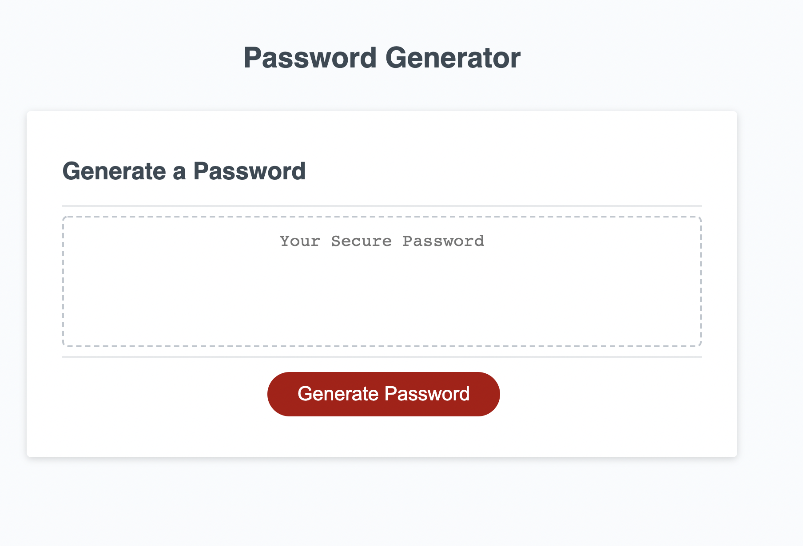

# Password Generator

## Summary

This website allows to generate random password based on certain criteria. When the "Generate Password" button is clicked, the user is presented with a prompt asking for the length of the password. The accepted password should be at least 8 characters and no more than 128 characters. If the users enters a text and not a number, an alert appears telling the user that his answer is not a number and the alert returns. When entering a valid number for the password length, the user is asked to confirm whether or not to include certain character types in the password. Character types can be lowercase, uppercase, numeric, and/or special characters. At least one character type should be selected. Then the password is generated based on the selected criteria and it appears in the text area.

## Screenshot of the password generated

A preview screenshot of the generated password:

## Built With

- [HTML](https://developer.mozilla.org/en-US/docs/Web/HTML)
- [CSS](https://developer.mozilla.org/en-US/docs/Web/CSS)
- [Javascript](https://developer.mozilla.org/en-US/docs/Web/JavaScript)

## Resources Used

- [W3schools](https://www.w3schools.com)
- [stackoverflow](https://stackoverflow.com)
- [MDN](https://developer.mozilla.org/en-US/docs/Web/CSS)

## Links

- [Deployed application](https://imanmansour86.github.io/password-generator/)

## Author

Iman Mansour

- [Portfolio](https://imanmansour86.github.io/portfolio/)
- [Github](https://github.com/imanmansour86)
- [LinkedIn](https://www.linkedin.com/in/iman-mansour-51391515/)
- [Email](mailto:imanmansour86@gmail.com)
